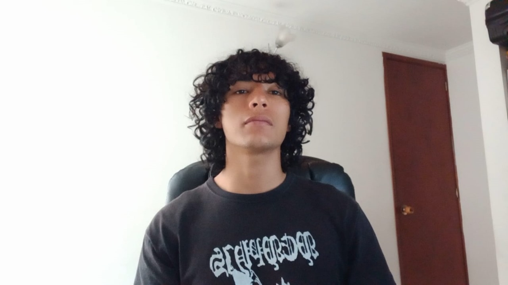
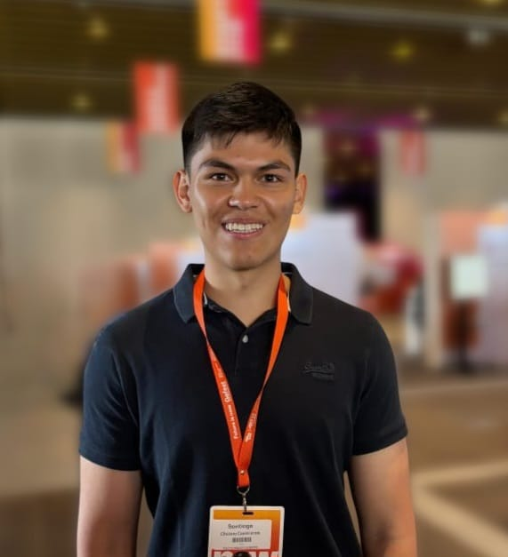
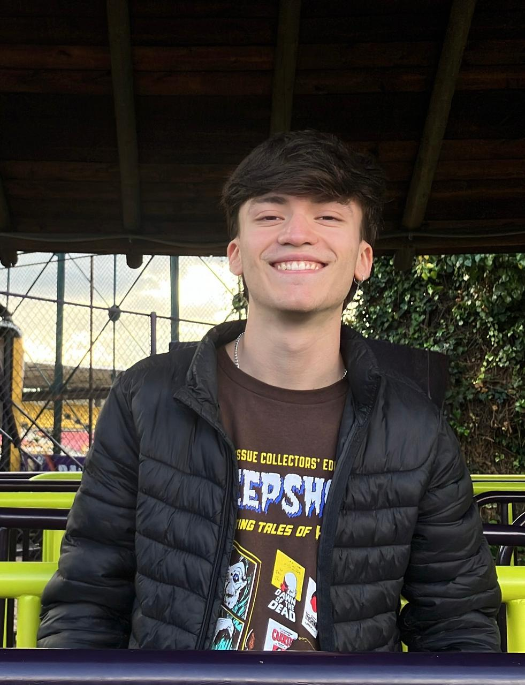
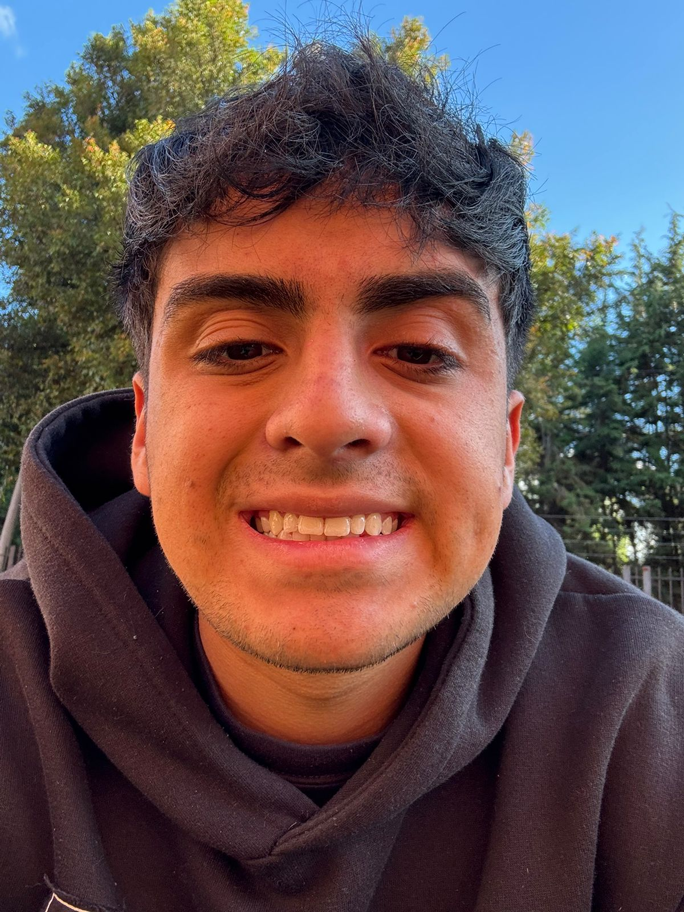
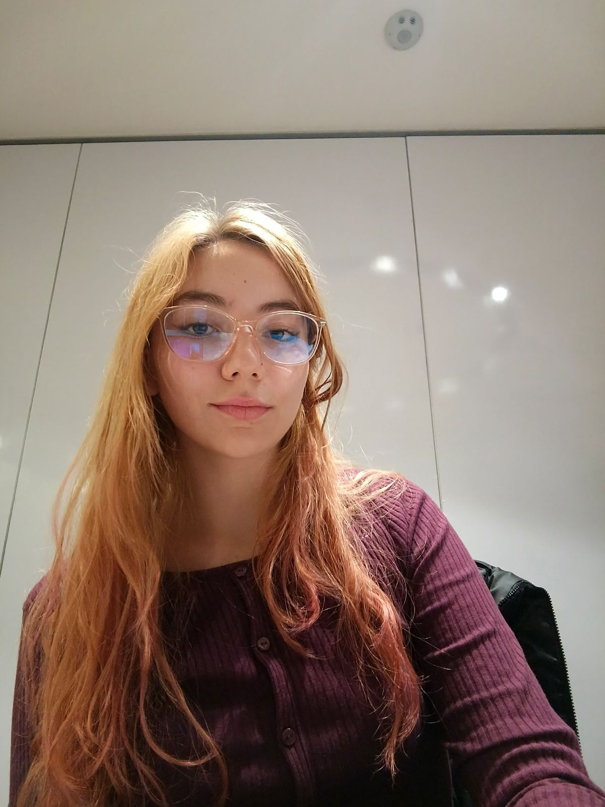

# FitMatch - Descubre tu estilo de manera intuitiva

**FitMatch** es una aplicación móvil inspirada en el estilo de Tinder, pero **enfocada en la moda**. ¿Estás cansado de perder tiempo navegando entre múltiples tiendas online sin encontrar ropa que realmente te guste? ¡Entonces FitMatch es la solución que estás buscando!

### ¿Qué hace a FitMatch único?

El objetivo principal de **FitMatch** es mejorar la visibilidad de las pequeñas y medianas empresas textiles emergentes, conectando de manera **dinámica y directa a compradores y vendedores** a través de un sistema de emparejamiento basado en tus **gustos y estilo personal**.

- **Descubre tu estilo** de manera intuitiva y fácil.
- Encuentra **tiendas locales** que se ajusten a tus preferencias.
- **Personaliza** tu experiencia de compra como nunca antes.
- ¡Y todo esto de una manera **divertida**!

En un mundo donde los marketplaces tradicionales no logran ofrecer una experiencia personalizada, **FitMatch** **te permite descubrir nuevas marcas locales** con los estilos que realmente te interesan, sin perder tiempo ni esfuerzo.

¡Con FitMatch, la forma de comprar ropa nunca ha sido tan divertida y personalizada!

---

# Presentación del Equipo

Este proyecto fue desarrollado por un equipo de estudiantes apasionados por la tecnología, el software y la robótica. A continuación, se presentan los integrantes del equipo:

## David Rodriguez

  
  

    
<strong>Edad:</strong> 19 años

    
<strong>Pasiones:</strong> Aprender y crear soluciones innovadoras.

    
<strong>Descripción:</strong> Me encuentro en constante búsqueda de retos que inspiren crecimiento personal y profesional.

  

## Santiago Chitiva

  
  

    
<strong>Carrera:</strong> Estudiante de ingeniería de sistemas

    
<strong>Intereses:</strong> Desarrollo de software y aprender nuevas tecnologías.

    
<strong>Motivación:</strong> Crear soluciones prácticas y seguir mejorando mis habilidades.

  

## André Landinez

  
  

    
<strong>Edad:</strong> 20 años

    
<strong>Carrera:</strong> Estudiante de ingeniería de sistemas en la Pontificia Universidad Javeriana

    
<strong>Intereses:</strong> Inteligencia artificial y tecnología Blockchain.

    
<strong>Motivación:</strong> Me motiva el aprendizaje constante, por lo que busco perfeccionar mis habilidades a través del uso de nuevas herramientas y tecnologías.

  

## Juan David Ordóñez

  
  

    
<strong>Edad:</strong> 19 años

    
<strong>Carrera:</strong> Estudiante de ingeniería de sistemas

    
<strong>Intereses:</strong> Deporte y desarrollo de software.

    
<strong>Descripción:</strong> Me gusta el trabajo en equipo y siempre estoy en búsqueda del aprendizaje constante.

  

## Valeria Catalina Caycedo Ramírez

  
  

    
<strong>Edad:</strong> 19 años

    
<strong>Carrera:</strong> Estudiante de ingeniería de sistemas y mecatrónica

    
<strong>Intereses:</strong> Presidenta del capítulo estudiantil RAS Javeriana. Robótica, cloud computing y contenedores.

    
<strong>Motivación:</strong> Aprender más sobre nuevas tecnologías y continuar desarrollando mis habilidades.

  

---

Este equipo está comprometido con el aprendizaje y la innovación tecnológica. ¡Esperamos que disfruten de nuestro proyecto!
